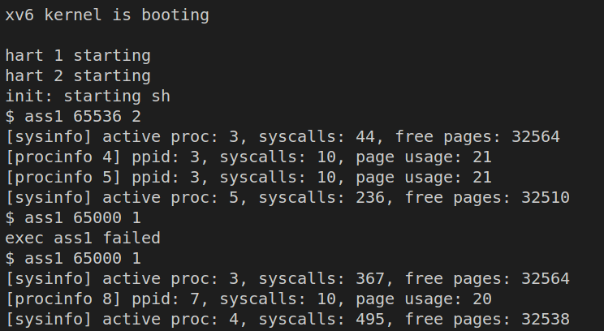

# Lab1 Report

This report describes our work on Lab 1. Section 1 presents a list of modified files. Section 2 explained our implementation and modification to the source files. Next, section 3 presents how the syscall is processed. Finally, section 4 gives a summary of the contribution of each member. Here is the link to our video https://drive.google.com/file/d/1bdDw6sdJnEK64VeRSdF64e8Sxm-EhHo-/view?usp=sharing.

## List of modified files:
```
├── kernel
│   ├── defs.h
│   ├── kalloc.c
│   ├── proc.c
│   ├── proc.h
│   ├── syscall.c
│   └── syscall.h
├── Makefile
└── user
    ├── user.h
    ├── usys.pl
    └── lab1_test.c
```

## Implementation Details:

### CLI output of lab1_test:


### Detailed explanation of our implementations
- Add syscall number in `kernel/syscall.h`

    ```c
    #define SYS_sysinfo  22
    #define SYS_procinfo  23
    ```
- Add syscall mapping array in `kernel/syscall.c`

    ```c
    static uint64 (*syscalls[])(void) = {
    \\ other syscalls ...
    [SYS_sysinfo] sys_sysinfo,
    [SYS_procinfo] sys_procinfo
    };
    ```

- Declare the following variable defined in other files in `kernel/syscall.c`
    ```c
    extern struct proc proc[NPROC];
    char *states[] = {
    [UNUSED]    "unused",
    [USED]      "used",
    [SLEEPING]  "sleep ",
    [RUNNABLE]  "runble",
    [RUNNING]   "run   ",
    [ZOMBIE]    "zombie"
    };
    extern struct {
    struct spinlock lock;
    struct run *freelist;
    } kmem;

    struct run {
    struct run *next;
    };
    ```

- Define `sys_sysinfo` in `kernel/syscall.c`
    * arg = 0, number of processes: Traverse along the linked list of PCB, `proc`. When a process is not `UNUSED`, increase the number of processes by one.  
    
    * arg = 1, number of syscalls: We define an intger variable to record the number of syscalls so far has been made. The variable is increased by one after a system call is finished in the function `syscall()` in `kernel/syscall.c`.
    
    * arg = 2, number of free pages: We go over the linked list of `kmem.freelist`. `kmem.lock` is held during the traverse. The number of free pages equal to the length of the `kmem.freelist`.
    
    * arg = otherwise: return -1.

    ```c
    uint64
    sys_sysinfo(void)
    {
    int arg = 0;
    int ret_val = 0;
    argint(0, &arg);
    if(arg == 0){
        struct proc *p;
        int num_proc = 0;
        for(p = proc; p < &proc[NPROC]; p++){
        if(p->state == UNUSED)
            continue;
        if(p->state >= 0 && p->state < NELEM(states) && states[p->state])
            num_proc += 1;
        }
        ret_val = num_proc;
    } 
    else if(arg == 1){
        ret_val = num_syscall;
    }
    else if(arg == 2){
        struct run *r = kmem.freelist;
        int num_free_page = 0;
        acquire(&kmem.lock);
        while(r){
        r = r->next;
        num_free_page += 1;
        }
        release(&kmem.lock);
        ret_val = num_free_page;
    }
    else{
        ret_val = -1;
    }
    return ret_val;
    }
    ```

- Define `sys_procinfo` in `kernel/syscall.c`
    * `ppid`: `ppid` is obatained with `myproc()->parent->pid`. `wait_lock` is held.

    * `syscall_count`: We add an int variable `num_syscall` in PCB. The `num_syscall` is initiliazed with zero in `allocproc()` in `kernel/proc.c`. Whenever a system call is finished, we update the `num_syscall` of a process with `myproc()->num_syscall += 1` in the function `syscall()`.

    * `page_usage`: We first obtain the memory usage from `myproc()->sz`, then compute the page usage with   `(myproc()->sz+4095) / 4096`. The page usage is rounded up.

    * `pinfo` is copied back to user space with the function `copyout`.  The first parameter, pagetable, is obtained from `myproc()`. The second parameter `dest` is obtained from argument. The third parameter is data source. The last parameter is data length.
    
    ```c
    uint64
    sys_procinfo(void)
    {
    uint64 dest;
    argaddr(0, &dest);
    struct {
        int ppid;
        int syscall_count;
        int page_usage;
    }pinfo;
    struct proc *p = myproc();
    acquire(&wait_lock);
    pinfo.ppid = p->parent->pid;
    release(&wait_lock);
    pinfo.syscall_count = p->num_syscall;
    pinfo.page_usage = (int)((p->sz+4095) / 4096);
    if(copyout(p->pagetable, dest, (char*)&pinfo, sizeof(pinfo))<0)
    return -1;
    return 0;
    }

    ```

- Declare `sysinfo` and `procinfo` in `user/user.h`
    ```c
    int sysinfo(int);
    int procinfo(void*);
    ```

- Redirect `sysinfo` and `procinfo` to syscall `sys_sysinfo` and `sys_procinfo` in `user/usys.pl`
    ```c
    entry("sysinfo");
    entry("procinfo");
    ```

## The process of syscall

- User space program makes a system call sysinfo. The sysinfo is then redirected to the following assemly in `user/usys.S`:
    ```assembly
    .global sysinfo
    sysinfo:
    li a7, SYS_sysinfo
    ecall
    ret
    ```
    The pseudoinstruction `li` load the macro `SYS_sysinfo` into register `a7`. The assembly `ecall` then traps the user mode into the kernel mode.

- The function `usertrap()` handles the interruption. `usertrap()` is called from `trampoline.S` with the following lines:
    ```assembly
    # load the address of usertrap(), from p->trapframe->kernel_trap
    ld t0, 16(a0)
    ```
    `usertrap()` then calls the `syscall()`. 


- In `syscall()`, the syscall number is fetched from register `a7`:
    ```c
    int num;
    struct proc *p = myproc();
    num = p->trapframe->a7;
    if(num > 0 && num < NELEM(syscalls) && syscalls[num]) {
    // Use num to lookup the system call function for num, call it,
    // and store its return value in p->trapframe->a0
    p->trapframe->a0 = syscalls[num]();
    }
    ```

- After the syscall finished, function `usertrapret()` is called in `usertrap()`. It returns to user mode from kernel mode.