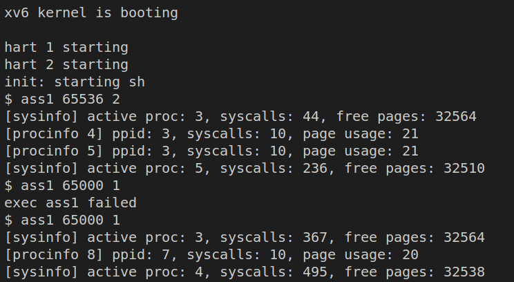

# Lab2 Report by Enzuo Zhu and Shixun WU

This report describes our work on Lab 2. Section 1, 2, 3 describes our implementation of Part 1, 2, 3, respectively. Here is the link to our video https://drive.google.com/file/d/1tfDxuuGesUYgBNltttsX1xB672o0Gp48/view?usp=sharing. 

Enzuo Zhu and Shixun Wu contribute to this project equally.

## Part 1:

We first add four int32 variables, namely `tick`, `tickets`, `stride`, and `pass` into the PCB struct as follows:

```c
// Per-process state
struct proc {
  struct spinlock lock;

  // p->lock must be held when using these:
  enum procstate state;        // Process state
  void *chan;                  // If non-zero, sleeping on chan
  int killed;                  // If non-zero, have been killed
  int xstate;                  // Exit status to be returned to parent's wait
  int pid;                     // Process ID

  // wait_lock must be held when using this:
  struct proc *parent;         // Parent process

  // these are private to the process, so p->lock need not be held.
  uint64 kstack;               // Virtual address of kernel stack
  uint64 sz;                   // Size of process memory (bytes)
  pagetable_t pagetable;       // User page table
  struct trapframe *trapframe; // data page for trampoline.S
  struct context context;      // swtch() here to run process
  struct file *ofile[NOFILE];  // Open files
  struct inode *cwd;           // Current directory
  char name[16];               // Process name (debugging)
  int num_syscall;
  
  // Lab2 Schedule
  int tick;
  int tickets;
  int stride;
  int pass;
};

```
These values are initialized in function `allocproc` as follows: 

```c
found:
  p->pid = allocpid();
  p->state = USED;
  p->num_syscall = 0;
  p->tick = 0;
  p->tickets = 10000;
  #if defined (STRIDE)
  p->stride = 1;
  p->pass = 0;
  #endif
```

The system call `sched_statistics()`  and `sched_tickets` are initialized with syscall number `24` and `25`, respectively. The implementations of `sched_statistics()` and `sched_tickets` are as follow:

```c
uint64 sys_sched_statistics(void){
  struct proc *p;
  for(p = proc; p < &proc[NPROC]; p++){
     if(p->state == UNUSED)
        continue;
      if(p->state >= 0 && p->state < NELEM(states) && states[p->state])
    printf("%d(%s): tickets: %d, ticks: %d\n", p->pid, p->name, p->tickets, p->tick);
  }
  return 0;
}
```

```c
#define stride_K 10000
uint64 sys_sched_tickets(void){
  int value_tickets;
  argint(0, &value_tickets);
  if(value_tickets > 10000) return -1;
  struct proc *p = myproc();
  p->tickets = value_tickets;
  #if defined(STRIDE)
  p->stride = stride_K / p->tickets;
  #endif
  return 0;
}
```

## Part 2:

We add the following code inside the loop of function `scheduler()` in `proc.h`. We paste our code snippet below.

### Lottery Scheduling
Our lottery scheduling has the following logic. First, the total number of tickets among all processes, `tot_tickets`, is computed by looping over the PCB array. After that, a random ticket `rand_lottery` is sampled by calling `rand() % tot_tickets`. Finally, an iteration over processes subtracts `rand_lottery` by the number of tickets of each iterated process until `rand_lottery` is less than zero. The last process in the iteration will be scheduled.

### Stride Scheduling
Our stride scheduling first finds the process with the minimum pass. Then we update the pass with the stride of the selected pass and schedule the selected process.


```c
void
scheduler(void)
{
  struct proc *p;
  struct cpu *c = mycpu();
  
  c->proc = 0;
  // int flag = 1;
  for(;;){

    // Avoid deadlock by ensuring that devices can interrupt.
    intr_on();
    // acquire(&proc_lock);
    #if defined(LOTTERY)
    int tot_tickets = 0;
    for(p = proc; p < &proc[NPROC]; p++) {
      acquire(&p->lock);
      if(p->state == RUNNABLE) {
        tot_tickets += p->tickets;
      }
      release(&p->lock);
    }
    // if (flag > 0){printf("LOTTERY\nNumOfTickets::%d\n",tot_tickets);flag--;}
    int rand_lottery = rand();
    
    rand_lottery = rand_lottery % tot_tickets;
    // int init_lottery = rand_lottery;
    for(p = proc; p < &proc[NPROC]; p++) {
      
      acquire(&p->lock);
      if(p->state == RUNNABLE) {
        
        if(rand_lottery < p->tickets){
          
          p->tick++;
          p->state = RUNNING;
          c->proc = p;
          // printf("pid: %d, ticks: %d\n", p->pid, p->tick);
          // printf("NumOfTickets:%d, init_lottery: %d,, cur_lottery: %d\n",tot_tickets, init_lottery, rand_lottery);
          swtch(&c->context, &p->context);

          // Process is done running for now.
          // It should have changed its p->state before coming back.
          c->proc = 0;
          release(&p->lock);
          break;
        }
        else{
          rand_lottery -= p->tickets;
        }
      }
      release(&p->lock);
    }

    #elif defined(STRIDE)
    // if (flag > 0){printf("STRIDE\n");flag--;}
    int min_pass = 2147483647;
    for(p = proc; p < &proc[NPROC]; p++) {
      acquire(&p->lock);
      if (p->state == RUNNABLE){
        if (p->pass < min_pass) min_pass = p->pass;
      }
      release(&p->lock);
    }
    for(p = proc; p < &proc[NPROC]; p++) {
      
      acquire(&p->lock);
      if(p->state == RUNNABLE) {
        if(p->pass == min_pass){
          
          p->tick++;
          p->pass += p->stride;
          p->state = RUNNING;
          c->proc = p;
          // printf("pid: %d, ticks: %d\n", p->pid, p->tick);
          // printf("NumOfTickets:%d, init_lottery: %d,, cur_lottery: %d\n",tot_tickets, init_lottery, rand_lottery);
          swtch(&c->context, &p->context);

          // Process is done running for now.
          // It should have changed its p->state before coming back.
          c->proc = 0;
          release(&p->lock);
          break;
        }
      }
      release(&p->lock);
    }
    #else
    for(p = proc; p < &proc[NPROC]; p++) {
      acquire(&p->lock);
      if(p->state == RUNNABLE) {
        // Switch to chosen process.  It is the process's job
        // to release its lock and then reacquire it
        // before jumping back to us.
        // printf("pid: %d, ticks: %d\n", p->pid, p->tick);
        p->tick++;
        p->state = RUNNING;
        c->proc = p;
        swtch(&c->context, &p->context);

        // Process is done running for now.
        // It should have changed its p->state before coming back.
        c->proc = 0;
      }
      release(&p->lock);
    }
    #endif
    // release(&proc_lock);
  }
}
```


### CLI output of lab1_test:


